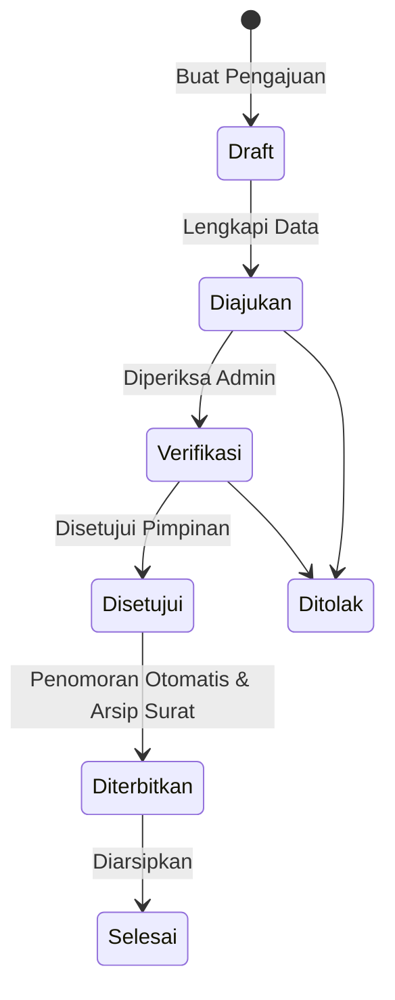

# SIPAS-DISHUB
**Sistem Informasi Persuratan Dinas Perhubungan Provinsi Riau**


## Tentang Project
SIPAS-DISHUB adalah platform sistem informasi yang dirancang secara khusus untuk mendigitalisasi dan menertibkan tata kelola persuratan serta administrasi kepegawaian pada instansi Dinas Perhubungan Provinsi Riau. Sistem ini bertujuan menekan birokrasi manual dengan mengintegrasikan pengelolaan surat masuk, surat keluar, disposisi, hingga layanan mandiri kepegawaian (seperti pengajuan cuti) dalam satu gerbang utama.

## Tujuan
1. Mendigitalisasi seluruh alur disposisi, surat masuk, dan surat keluar menjadi paperless.
2. Menciptakan infrastruktur otomasi penomoran surat secara terpusat untuk menghindari konflik/nomor ganda.
3. Memusatkan manajemen arsip kepegawaian (mutasi, kepangkatan, dan cuti) secara terintegrasi dengan arsip persuratan resmi.

## Fitur Berdasarkan Modul

### Modul Inti & Persuratan
- ✅ **Authentication**: Sistem *login* aman berbasis Role.
- ✅ **Dashboard**: Ringkasan metrik statistik surat.
- ✅ **Surat Masuk**: Pencatatan, unggah *attachment*, dan pelacakan surat masuk.
- ✅ **Surat Keluar**: Pembuatan draf, integrasi *TemplateProcessor* (pembuatan dokumen DOCX otomatis dari database), konversi PDF, dan penomoran.
- ✅ **Disposisi**: Distribusi surat dan instruksi pimpinan.
- ✅ **Laporan**: Rekapitulasi persuratan berdasarkan periode waktu.

### Modul Master Data
- ✅ **Master Jenis Surat**: Standardisasi format surat dinas.
- ✅ **Klasifikasi Surat**: Kategorisasi berdasarkan tata naskah dinas resmi.
- ✅ **Unit Kerja**: Struktur hierarki organisasi Dinas Perhubungan.
- ✅ **Pegawai**: Sentralisasi data demografi, NIP, pangkat, dan jabatan.
- ✅ **Riwayat Jabatan/Pangkat**: Pencatatan historis karier pegawai dengan sistem _Observer_.

### Modul Kepegawaian (Phase 3)
- ✅ **Pengajuan Cuti**: Pengajuan *online* berjenjang dari draft hingga terbitnya Surat Keputusan Cuti resmi.
- 🚧 **Kenaikan Pangkat**: Proses bisnis dan API Backend tersedia (UI masih dalam pengembangan).
- 🚧 **Gaji Berkala (KGB)**: Proses penghitungan otomasi *TMT* (Terhitung Mulai Tanggal) tersedia pada Backend (UI masih dalam pengembangan).

## Workflow Pengajuan Cuti

Proses pengajuan Cuti direpresentasikan melalui *state-machine* tertutup. Pada operasional saat ini, sistem cukup dinavigasi secara penuh oleh **satu akun Administrator/Operator Utama** yang mengorkestrasi keseluruhan tahapan tanpa hambatan multi-akun.



## Arsitektur Sistem

SIPAS-DISHUB mengusung arsitektur terpadu (*tightly coupled modules*) dengan karakteristik utama:
1. **Central Surat**: Seluruh arsip berpusat pada satu tabel `surat` tunggal. Field `arah` (`masuk`/`keluar`) digunakan untuk memisahkan domain pencarian arsip.
2. **Polymorphic Infrastructure**:
   - `Attachment`: Dokumen fisik disimpan menggunakan relasi Polymorphic, memungkinkan Pengajuan Cuti, Surat Keluar, maupun Disposisi memiliki berkasnya masing-masing secara modular.
   - `ActivityLog`: Perekaman histori mutasi status secara otonom (*Observer-based*) bagi semua modul dokumen.
3. **Pemisahan Entitas Surat**: Konteks format (`jenis_surat`) dipisahkan dari kodifikasi dokumen resmi (`klasifikasi_surat`).
4. **DocumentSequence & DocumentNumberService**: Otoritas final penomoran dikunci dalam mekanisme `DB::transaction` secara *idempotent*. Nomor dokumen dinas tidak diberikan ketika _Draft_, melainkan **hanya dicetak ketika status mencapai finalisasi/Penerbitan**.
5. **Relasi Modul Cuti**: Entitas Pengajuan Cuti memiliki *MorphOne* ke model `Surat`, mengintegrasikan proses persetujuan langsung menjadi arsip persuratan instansi tanpa redundansi.

## Teknologi Utama

- **Framework**: Laravel 13.30.1
- **Bahasa**: PHP 8.4.12
- **Frontend**: Blade Templating, Tailwind CSS, AlpineJS, Vite
- **Database**: SQLite / MySQL / PostgreSQL (Abstraksi Eloquent ORM)
- **Document Processing**: PhpOffice/PhpWord 1.4

## Struktur Project

```text
SIPAS-DISHUB/
├── app/
│   ├── Http/Controllers/ (CutiController, SuratController, dll)
│   ├── Models/           (Surat, PengajuanCuti, ActivityLog, dll)
│   ├── Observers/        (ActivityLogObserver, PegawaiObserver)
│   └── Services/         (DocumentNumberService)
├── database/
│   ├── migrations/       (Skema DB Additive / Non-Destructive)
│   └── seeders/          (RoleSeeder, JenisSuratSeeder, dll)
├── resources/
│   └── views/            (Blade layouts, kepegawaian, surat-keluar, dll)
├── storage/              (File unggahan, Template .docx)
└── tests/                (Automated Test Suites)
```

## Database (Core Diagram)

Secara garis besar, entitas vital yang menyusun sistem ini meliputi:
- **`surat`**: Menyimpan referensi surat. Field `source_type` dan `source_id` memungkinkan modul pihak ketiga (mis. Cuti) mendeklarasikan surat ini.
- **`pengajuan_cuti`**: Menyimpan status persetujuan, data cuti, dan durasi.
- **`pegawai`** & **`riwayat_jabatan_pangkat`**: Riwayat dipicu secara pasif (`Observer`) setiap ada perubahan atribut jabatan pada tabel `pegawai`.

## Keamanan dan Validasi

- **Role-Based Access Control (RBAC)**: Pembatasan rute dan manipulasi formulir melalui fungsi pengecekan lapis _Backend_ (`abort(403)` jika hak akses tidak valid).
- **Idempotency Finalisasi**: Pencegahan eksekusi berulang dari *Double-Submit* maupun URL refreshes agar Surat Keputusan dan nomor seri tidak bocor (menggunakan `lockForUpdate` di *transaction* `DocumentSequence`).
- **File Validation**: Autentikasi ketat pada MIME-Type untuk setiap `Attachment`.

## Instalasi & Menjalankan Project Local

Kloning repositori ini dan lakukan konfigurasi:

```bash
# 1. Install dependensi PHP
composer install

# 2. Install dependensi Frontend
npm install

# 3. Konfigurasi Lingkungan
cp .env.example .env
php artisan key:generate

# 4. Hubungkan Storage (Untuk unggahan lampiran dan Template)
php artisan storage:link

# 5. Bangun Database (JANGAN GUNAKAN migrate:fresh di server production!)
php artisan migrate
php artisan db:seed

# 6. Kompilasi Aset Frontend (Tailwind)
npm run build
# Atau untuk environment pengembangan: npm run dev

# 7. Jalankan Server PHP
php artisan serve
```

## Konfigurasi
Modifikasi pengaturan penting pada file `.env` (berkiblat pada file `.env.example`).
Pastikan `APP_URL` merepresentasikan alamat domain agar fitur unduhan _Template_ dan URL gambar *attachment* merespons dengan benar. Konfigurasi kredensial *database* harus dijaga kerahasiaannya.

## Testing

Sistem dilengkapi Automated Test Suites untuk mengonfirmasi kelayakan *Workflow*.
Gunakan perintah berikut:
```bash
php artisan test
```
**Hasil Aktual (Pada Tahap Phase 3):**
`35 Tests / 111 Assertions: PASSED` (Fungsionalitas menyeluruh tervalidasi).

## Roadmap Pengembangan

- **Completed** ✅ : Phase 1 (Master Data), Phase 2 (Centralized Infrastructure, Sequence Numbering, Attachment Polymorphic, Activity Log), Phase 3 UI Cuti (Fully Workflow Operational).
- **In Progress** 🚧 : Antarmuka (UI) khusus modul Kenaikan Pangkat dan Gaji Berkala (KGB).
- **Planned** 📋 : Modul Laporan Tingkat Lanjut, Persetujuan Multi-Pimpinan Berjenjang.

## Status Project

| Modul | Status |
|---|---|
| Surat Masuk / Keluar | ✅ Completed |
| Disposisi | ✅ Completed |
| Master Pegawai | ✅ Completed |
| Document Infrastructure | ✅ Completed |
| UI Pengajuan Cuti | ✅ Completed |
| Kenaikan Pangkat | 🚧 In Progress (Backend Done, UI Pending) |
| Gaji Berkala (KGB) | 🚧 In Progress (Backend Done, UI Pending) |

## Pengembang
Dikembangkan dalam konteks Kerja Praktik / Sistem Akademik untuk memenuhi operasionalisasi digital pada Dinas Perhubungan Provinsi Riau.

## Lisensi
*Project ini dikembangkan untuk kebutuhan akademik dan sistem operasional internal. Informasi lisensi spesifik berada di tangan pihak pengelola institusi terkait.*
